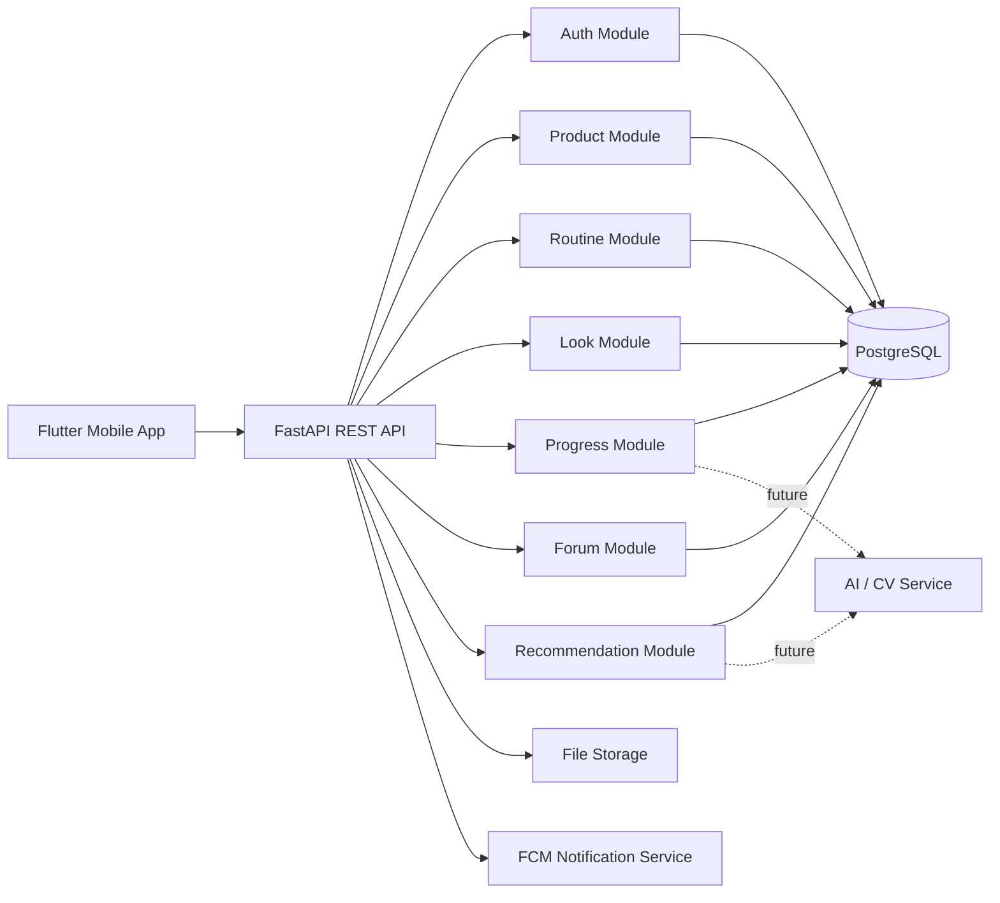

# Sprint 0 - Product Discovery and System Architecture

## 1. Sprint Goal

Sprint 0 amaci, `SkinCheck AI` projesinin kod yazmadan once urun, mimari ve veri modelini netlestirmektir. Bu sprint sonunda ekip, neyi neden yaptigini bilen, MVP sirasi tanimli, ekranlari ve backend sinirlari belirlenmis bir temel dokumantasyona sahip olur.

## 2. Product Vision

`SkinCheck AI`, kullanicinin guzellik ve cilt bakim rutinini tek uygulamada takip etmesini saglayan mobil bir asistandir. Uygulama; makyaj urunlerini yonetme, urun omru takibi, skincare rutini, ilerleme fotograflari, kullanici geri bildirimi, topluluk ve kural tabanli oneriler etrafinda konumlanir.

Temel deger onerisi:

- Kullanici sahip oldugu urunleri duzenli takip eder.
- Acildiktan sonra kullanim omru yaklasan urunleri gorur.
- Skincare rutinlerini aksatmadan ilerletir.
- Makyaj look'larini ve cilt ilerlemesini fotograflarla arsivler.
- Kullanim ve feedback verilerinden guvenli, medikal iddia icermeyen oneri alir.

## 3. MVP Scope

MVP icin hedeflenen sprint kapsami:

- Sprint 0: Product discovery ve architecture
- Sprint 1: Authentication ve design system
- Sprint 2: Dashboard
- Sprint 3: Makeup product diary
- Sprint 4: PAO ve expiration tracking
- Sprint 5: Notification system
- Sprint 6: Product usage counter
- Sprint 7: Favorites
- Sprint 8: Makeup look journal
- Sprint 9: Skincare routine tracker
- Sprint 10: Before/after progress tracking
- Sprint 11: Feedback system

Faz 2 kapsami:

- Sprint 12: Recommendation engine
- Sprint 13: Community forum
- Sprint 14: Product insight summary
- Sprint 15: AI-assisted photo comparison
- Sprint 16: Analytics dashboard

## 4. Personas

### Persona 1 - Organized Beauty User

- 22-35 yas arasi
- Birden fazla makyaj ve skincare urunu kullaniyor
- Urunlerini kaybetmek, unutmak veya son kullanma tarihini kacirmak istemiyor

### Persona 2 - Routine Builder

- Duzenli skincare rutini kurmak istiyor
- Sabah/gece rutinlerinde motivasyon ve takip aracina ihtiyac duyuyor
- Ilerlemeyi foto ile gormek istiyor

### Persona 3 - Insight Seeker

- Urunun kendisinde ise yariyor mu anlamak istiyor
- Duzenli not, feedback ve comparison takibi istiyor
- AI ve topluluk verilerinden destek almak istiyor

## 5. User Stories

### Authentication

- Kullanici olarak hesap olusturmak istiyorum ki verilerim bana ozel saklanabilsin.
- Kullanici olarak giris yapmak istiyorum ki onceki urunlerime ve rutinlerime ulasabileyim.
- Kullanici olarak profilimi tamamlamak istiyorum ki deneyim bana gore kisilestirilebilsin.

### Makeup Product Diary

- Kullanici olarak makyaj urunu eklemek istiyorum ki sahip oldugum urunleri tek yerde gorebileyim.
- Kullanici olarak barkod veya manuel giris yapabilmek istiyorum ki urun eklemek hizli olsun.
- Kullanici olarak favori urunlerimi isaretlemek istiyorum ki look olustururken kolayca secebileyim.

### Expiration Tracking

- Kullanici olarak bir urunu ne zaman actigimi kaydetmek istiyorum ki PAO suresi takip edilebilsin.
- Kullanici olarak suresi yaklasan urunleri gormek istiyorum ki guvenli kullanimi surdurebileyim.

### Usage Tracking

- Kullanici olarak bir urunu bugun kullandigimi isaretlemek istiyorum ki kullanim aliskanligimi anlayabileyim.
- Kullanici olarak en az ve en cok kullandigim urunleri gormek istiyorum ki satin alma ve kullanim kararlarimi iyilestirebileyim.

### Looks

- Kullanici olarak yaptigim makyajin fotografini ve notlarini kaydetmek istiyorum ki ayni look'u tekrar olusturabileyim.
- Kullanici olarak kullandigim urunleri bir look ile eslestirmek istiyorum ki hangi kombinasyonlari sevdigimi hatirlayabileyim.

### Skincare

- Kullanici olarak sabah ve gece rutinimi adim adim takip etmek istiyorum ki duzenimi koruyabileyim.
- Kullanici olarak hangi gunleri atladigimi gormek istiyorum ki aliskanliklarimi gelistirebileyim.

### Progress and Feedback

- Kullanici olarak before/after fotograflari yuklemek istiyorum ki zaman icindeki gorunur degisimi izleyebileyim.
- Kullanici olarak 7, 14 ve 30 gun sonunda feedback vermek istiyorum ki urunun bende nasil bir etki biraktigini kaydedebileyim.

### Community and Recommendations

- Kullanici olarak diger kullanicilarin deneyimlerini okumak istiyorum ki satin alma veya kullanim kararlarimi destekleyebileyim.
- Kullanici olarak uygulamanin kullanim ve feedback verime gore guvenli oneriler sunmasini istiyorum ki daha bilincli hareket edebileyim.

## 6. Functional Requirements

### Core Account

- Sistem email ve sifre ile kayit olusturabilmeli.
- Sistem JWT tabanli oturum yonetimi saglamali.
- Kullanici profil bilgileri ayri bir profil yapisinda tutulmali.

### Product Management

- Kullanici makyaj urunu ekleyebilmeli, duzenleyebilmeli, silebilmeli.
- Urunler kategori, marka, isim, tarih ve favori durumuna gore saklanmali.
- Urunler icin PAO ve expiration bilgisi tutulmali.

### Product Tracking

- Sistem acilis tarihine gore expiration tarihi hesaplayabilmeli.
- Sistem expiring soon ve expired durumlarini turetmeli.
- Kullanici urun kullanimini tek tikla loglayabilmeli.

### Dashboard

- Sistem ana ekranda ozet veri gostermeli.
- Dashboard expiring products, favorite products, routine state, latest look ve reminder bilgileri icermeli.

### Looks

- Kullanici foto ile look kaydi olusturabilmeli.
- Look birden fazla urun ile iliskilendirilebilmeli.
- Look not, mood ve occasion alanlarini desteklemeli.

### Skincare Routine

- Kullanici skincare urunlerini ve rutinlerini tanimlayabilmeli.
- Rutin adimlari tamamlandi olarak isaretlenebilmeli.
- Sistem streak ve history gorebilmeli.

### Progress Tracking

- Kullanici trial baslatabilmeli.
- Trial icin before ve sonraki progress fotograflari saklanabilmeli.
- Sistem timeline mantigiyla gelisim kayitlarini gosterebilmeli.

### Feedback

- Kullanici belirli donemlerde urun geri bildirimi verebilmeli.
- Sistem olumlu/olumsuz etkileri ve continue decision bilgisini saklamali.

### Notification

- Uygulama cihaz token saklayabilmeli.
- Sistem kullanici tercihine gore planli bildirim gonderebilmeli.

### Community

- Kullanici post olusturabilmeli, yorum yapabilmeli, begenebilmeli, raporlayabilmeli.
- Forum akisinda basit moderasyon durumu bulunmali.

### Recommendation

- Sistem kural tabanli olarak continue, caution, replace soon gibi oneriler uretmeli.
- Oneriler medikal tani veya kesin sonuc dili kullanmamali.

## 7. Non-Functional Requirements

- Guvenlik: sifreler hashlenmeli, JWT kisa omurlu olmali, API yetkilendirme zorunlu olmali.
- Mahremiyet: kullanici fotograflari ve kisisel veriler yalnizca ilgili kullaniciya ait olmali.
- Performans: dashboard ve urun listeleri mobil kullanim icin hizli acilmali.
- Olceklenebilirlik: backend moduler servis yapisina genisleyebilmeli.
- Bakim kolayligi: Flutter ve FastAPI tarafinda clean architecture benzeri ayrim uygulanmali.
- Test edilebilirlik: domain ve service katmani unit test ile dogrulanabilir olmali.
- Erişilebilirlik: buyuk font, yeterli kontrast ve acik hata mesajlari desteklenmeli.
- Guvenli dil: urun veya cilt etkileri hakkinda medikal claim kullanilmamali.

## 8. Use Case Diagram Description

Ana aktorler:

- Guest
- Authenticated User
- Admin/Moderator
- Notification Service
- Future AI Service

Baslica use case'ler:

1. `Guest`
- Register
- Login
- View onboarding

2. `Authenticated User`
- Complete profile
- Add/edit/delete product
- Mark product as favorite
- Log product usage
- Update opened date and PAO
- View dashboard summary
- Create/edit/delete makeup look
- Create skincare routine
- Complete routine step
- Start skincare trial
- Upload progress photo
- Submit feedback
- Manage notification settings
- Browse forum
- Create post
- Add comment
- Report content
- View recommendations

3. `Admin/Moderator`
- Review reported forum posts
- Update moderation status

4. `Notification Service`
- Send expiration reminder
- Send skincare reminder
- Send progress photo reminder

5. `Future AI Service`
- Compare photos
- Generate recommendation support signals

## 9. ER Diagram Description

### Core Entities

- `users`
  - id, email, password_hash, status, created_at

- `user_profiles`
  - id, user_id, display_name, skin_type, birth_date, avatar_url, timezone

### Product Domain

- `product_categories`
  - id, name, type

- `makeup_products`
  - id, user_id, category_id, brand, name, barcode, image_url, purchase_date, opened_date, pao_months, expiration_date, expiration_status, price, notes, is_favorite, usage_count

- `product_usage_logs`
  - id, product_id, user_id, used_at

### Looks Domain

- `makeup_looks`
  - id, user_id, title, image_url, mood, occasion, created_at

- `makeup_look_products`
  - id, look_id, product_id

- `look_notes`
  - id, look_id, sharp_notes, reminder_notes

### Skincare Domain

- `skincare_products`
  - id, user_id, name, brand, category, image_url, notes

- `skincare_routines`
  - id, user_id, title, period, is_active

- `routine_steps`
  - id, routine_id, product_id, step_order, instruction

- `routine_logs`
  - id, routine_id, step_id, user_id, completed_at

### Progress and Feedback Domain

- `product_trials`
  - id, user_id, skincare_product_id, started_at, target_days, status

- `progress_photos`
  - id, trial_id, user_id, image_url, captured_at, note, phase

- `product_feedbacks`
  - id, user_id, product_id, trial_id, feedback_period, improvement_rating, irritation, dryness, breakout, continue_decision, notes, created_at

### Community Domain

- `forum_posts`
  - id, user_id, title, body, product_id, skin_type_tag, usage_duration_tag, moderation_status, created_at

- `forum_comments`
  - id, post_id, user_id, body, created_at

- `forum_likes`
  - id, post_id, user_id, created_at

- `forum_reports`
  - id, post_id, user_id, reason, created_at, status

### Notification Domain

- `notification_settings`
  - id, user_id, device_token, expiration_enabled, skincare_enabled, progress_enabled, water_enabled, reminder_time

- `notification_logs`
  - id, user_id, type, scheduled_for, sent_at, status

### High-Level Relations

- Bir `user` bir `user_profile` kaydina sahiptir.
- Bir `user` birden fazla `makeup_product`, `makeup_look`, `skincare_routine`, `product_trial`, `forum_post` ve `notification_setting` verisine sahiptir.
- Bir `makeup_product` bir `product_category` ile iliskilidir.
- Bir `makeup_product` birden fazla `product_usage_log` uretir.
- Bir `makeup_look` birden fazla `makeup_product` ile `makeup_look_products` ara tablosu uzerinden iliskilidir.
- Bir `skincare_routine` birden fazla `routine_step` barindirir.
- Bir `product_trial` birden fazla `progress_photo` ve `product_feedback` ile iliskilidir.
- Bir `forum_post` birden fazla `forum_comment`, `forum_like` ve `forum_report` ile iliskilidir.

## 10. System Architecture

### Architecture Style

- Mobile client: `Flutter`
- API layer: `FastAPI`
- Database: `PostgreSQL`
- Object/file storage: future `S3-compatible storage` veya `Firebase Storage`
- Notifications: `Firebase Cloud Messaging`
- Background jobs: future queue/cron worker
- AI/vision layer: sonraki fazda ayri servis

### Logical Layers

1. Presentation Layer
- Flutter screens
- State management
- Form validation
- Reusable design system components

2. Application Layer
- Use case orchestration
- DTO mapping
- Session and permission flow

3. Domain Layer
- Product lifecycle kurallari
- Usage tracking kurallari
- Routine completion kurallari
- Feedback ve recommendation kurallari

4. Infrastructure Layer
- REST controllers
- ORM/repository implementations
- Push notification gateway
- File storage gateway

### Request Flow

1. Kullanici Flutter uygulamasinda islem baslatir.
2. UI state katmani use case'i tetikler.
3. Use case HTTP client ile FastAPI endpoint'ine istek yollar.
4. FastAPI router request'i service katmanina aktarir.
5. Service katmani repository uzerinden PostgreSQL ile konusur.
6. Gerekirse notification veya file storage entegrasyonu calisir.
7. Sonuc JSON response olarak mobile cihaza doner.

### Mermaid Architecture Diagram



## 11. Low-Fidelity Wireframe Descriptions

### Splash

- Tam ekran marka logosu
- Alt kisimda kisa tagline
- Hafif gradient arka plan

### Onboarding

- 3 kaydirilabilir sayfa
- Her sayfada buyuk illustasyon
- Baslik, aciklama, ilerleme gostergesi
- Son sayfada `Get Started`

### Login

- Ustte hosgeldin mesaji
- Email ve sifre alanlari
- `Forgot password`
- Primary CTA: `Login`
- Secondary CTA: `Create account`

### Register

- Ad, email, sifre, sifre tekrar alanlari
- Kosullar checkbox
- Primary CTA: `Create account`

### Main Navigation

- Alt navigasyon
- Tabs: `Home`, `Bag`, `Looks`, `Skincare`, `Forum`, `Profile`

### Beauty Dashboard

- Ustte kullanici selamlama alani
- Hemen altta bugunun ozet kartlari
- Bolumler:
  - Expiring products
  - Rarely used products
  - Favorite products carousel
  - Today's skincare
  - Latest look
  - Progress reminder
  - Forum highlights

### Makeup Bag

- Ustte arama ve kategori filtreleri
- Grid halinde urun kartlari
- Sag altta `Add Product` FAB

### Looks

- Foto-first masonry/grid liste
- Yeni look ekleme butonu
- Look detayinda buyuk gorsel + kullanilan urunler + notlar

### Skincare

- Morning/Night segmented control
- Checklist seklinde rutin adimlari
- Streak ve skipped days kartlari

### Forum

- Feed yapisi
- Ustte `Create Post`
- Kartlarda urun etiketi, skin type etiketi, yorum ve like sayisi

### Profile

- Avatar, isim, cilt tipi ve hesap ayarlari
- Notification, privacy, legal ve delete account alanlari

## 12. Flutter Folder Structure

```text
flutter_app/
  lib/
    app/
      app.dart
      router/
      theme/
      di/
    core/
      constants/
      errors/
      network/
      utils/
      widgets/
    features/
      auth/
        data/
          datasources/
          models/
          repositories/
        domain/
          entities/
          repositories/
          usecases/
        presentation/
          controllers/
          screens/
          widgets/
      dashboard/
      products/
      looks/
      skincare/
      progress/
      feedback/
      forum/
      notifications/
      settings/
    l10n/
    main.dart
  test/
    widget/
    unit/
```

## 13. FastAPI Folder Structure

```text
backend/
  app/
    api/
      deps.py
      routers/
        auth.py
        users.py
        dashboard.py
        products.py
        looks.py
        skincare.py
        progress.py
        feedback.py
        forum.py
        notifications.py
        recommendations.py
    core/
      config.py
      security.py
      database.py
    domain/
      entities/
      services/
      repositories/
    models/
      user.py
      user_profile.py
      product.py
      product_usage_log.py
      look.py
      skincare.py
      progress.py
      feedback.py
      forum.py
      notification.py
    schemas/
    repositories/
    services/
    integrations/
      storage/
      notifications/
      ai/
    tests/
      api/
      services/
    main.py
  migrations/
  requirements/
    base.txt
    dev.txt
  Dockerfile
```

## 14. Sprint 0 Deliverables Checklist

- Product vision tanimlandi
- MVP ve phase 2 kapsami ayrildi
- Persona seti yazildi
- User story'ler yazildi
- Functional requirements cikartildi
- Non-functional requirements listelendi
- Use case aciklamasi hazirlandi
- ERD aciklamasi ve ana tablolar belirlendi
- Sistem mimarisi secildi
- Ana ekranlar icin low-fidelity wireframe tanimlari yazildi
- Flutter ve FastAPI klasor yapisi onerildi

## 15. Decisions and Assumptions

- Mobil istemci olarak `Flutter` secildi.
- Backend tarafinda hizli gelisim ve test kolayligi icin `FastAPI` secildi.
- Veritabani olarak iliskisel yapi ihtiyaci nedeniyle `PostgreSQL` secildi.
- AI/Computer Vision kabiliyeti MVP'ye dahil edilmedi; sonraki faza ayrildi.
- Uygulama guvenli beauty assistant dili kullanacak, medikal tani iddiasi kullanmayacak.

## 16. Exit Criteria

Sprint 0 tamamlanmis sayilmasi icin:

- Tum ekip urun kapsami uzerinde ayni anlayisa sahip olmali.
- Sprint 1 gelistirmesine baslamak icin gerekli ekran listesi net olmali.
- Auth, dashboard ve product domain'leri icin veri modeli anlasilir olmali.
- Mimari secimlerde belirsizlik kalmamis olmali.
- Sprint 1 backlog'u bu dokumana dayanarak cikartilabilir olmali.
